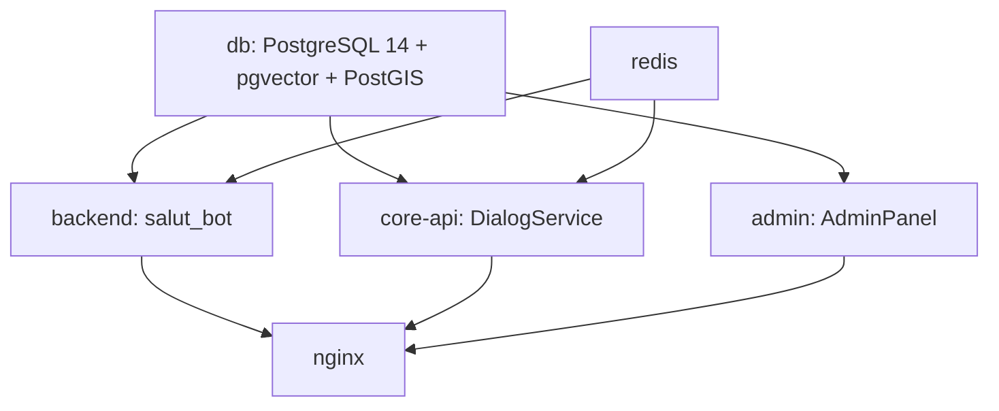

# План замены БД из дампа dump-eco-ismultiple.sql

## Контекст

| Параметр | Значение |
|----------|----------|
| СУБД | PostgreSQL 14 + pgvector + PostGIS |
| Контейнер | `db` (из `docker-compose.yml`, собирается из `./db_custom/Dockerfile`) |
| Имя БД | `eco` |
| Volume данных | `./data/postgres_data:/var/lib/postgresql/data` |
| Файл дампа | `d:/Praktika2026/dump-eco-ismultiple.sql` |
| Пользователь БД | `postgres` (из `db_custom/.env.example`) |

## Зависимости сервисов от БД



## План действий

### Шаг 1: Остановить сервисы, зависящие от БД

Перед заменой БД нужно остановить сервисы, которые могут писать в БД или читать из неё:

```bash
cd d:/Praktika2026
docker-compose stop admin core-api backend
```

> **Примечание:** `nginx` и `redis` можно не останавливать — они не зависят от БД напрямую.

### Шаг 2: Создать резервную копию текущей БД (опционально, но рекомендуется)

На случай, если что-то пойдёт не так, создадим бэкап текущей БД:

```bash
docker-compose exec -T db pg_dump -U postgres -d eco > backup-eco-$(date +%Y%m%d_%H%M%S).sql
```

### Шаг 3: Удалить старую БД и создать пустую

Нужно подключиться к БД `postgres` (служебная БД) и выполнить:

```sql
DROP DATABASE IF EXISTS eco WITH (FORCE);
CREATE DATABASE eco;
```

Через Docker:

```bash
# Подключаемся к БД postgres и пересоздаём БД eco
docker-compose exec -T db psql -U postgres -d postgres -c "DROP DATABASE IF EXISTS eco WITH (FORCE);"
docker-compose exec -T db psql -U postgres -d postgres -c "CREATE DATABASE eco;"
```

> **Вариант 3а (если дамп НЕ содержит CREATE DATABASE):**
> Если дамп начинается сразу с `CREATE TABLE`, то после создания пустой БД `eco` нужно также установить расширения:
> ```bash
> docker-compose exec -T db psql -U postgres -d eco -c "CREATE EXTENSION IF NOT EXISTS vector;"
> docker-compose exec -T db psql -U postgres -d eco -c "CREATE EXTENSION IF NOT EXISTS postgis;"
> ```

### Шаг 4: Загрузить дамп в БД eco

```bash
type d:\Praktika2026\dump-eco-ismultiple.sql | docker-compose exec -T db psql -U postgres -d eco
```

Или альтернативный вариант (копирование файла в контейнер):

```bash
docker cp d:\Praktika2026\dump-eco-ismultiple.sql db:/tmp/dump.sql
docker-compose exec -T db psql -U postgres -d eco -f /tmp/dump.sql
```

### Шаг 5: Перезапустить остановленные сервисы

```bash
docker-compose start backend core-api admin
```

### Шаг 6: Проверить, что всё работает

1. Проверить, что таблицы созданы:
   ```bash
   docker-compose exec -T db psql -U postgres -d eco -c "\dt"
   ```

2. Проверить количество записей в ключевых таблицах:
   ```bash
   docker-compose exec -T db psql -U postgres -d eco -c "SELECT count(*) FROM information_schema.tables WHERE table_schema = 'public';"
   ```

3. Проверить логи сервисов на наличие ошибок:
   ```bash
   docker-compose logs --tail=50 backend
   docker-compose logs --tail=50 admin
   ```

4. Проверить доступность API (если есть тестовые эндпоинты).

## Примечания

- Если дамп содержит `CREATE DATABASE eco` и `\connect eco`, то Шаг 3 можно пропустить — дамп сам создаст БД. Но в этом случае нужно убедиться, что старая БД удалена (Шаг 3.1: `DROP DATABASE IF EXISTS eco WITH (FORCE);`).
- Если дамп НЕ содержит `CREATE DATABASE`, то нужно выполнить Шаг 3 полностью, включая создание расширений (Вариант 3а).
- Расширения `vector` и `postgis` требуются для работы приложения (см. `db_custom/Dockerfile`).
- Команда `DROP DATABASE ... WITH (FORCE)` доступна в PostgreSQL 13+, она принудительно завершает все подключения к БД и удаляет её.