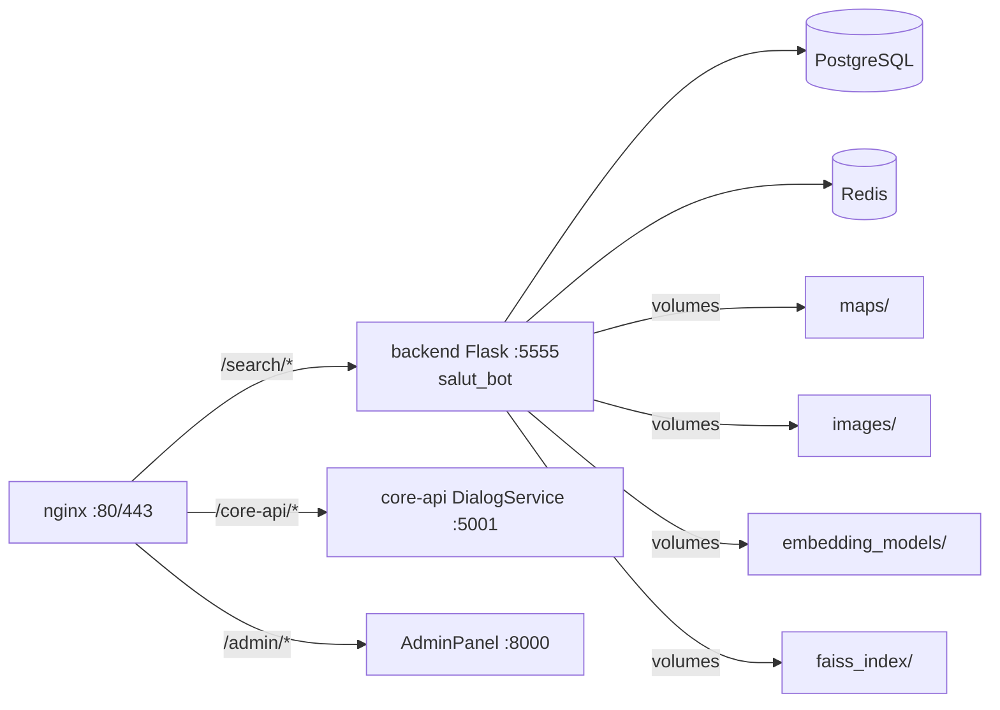
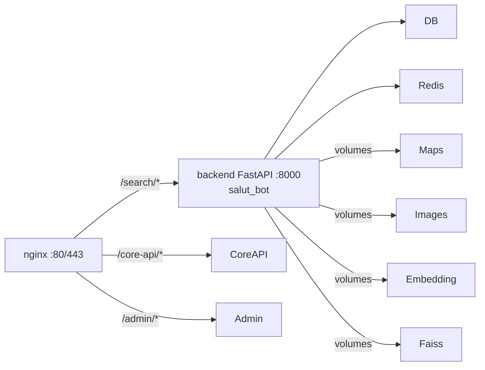

# План in-place миграции salut_bot с Flask на FastAPI

## Цель
Заменить файлы в `salut_bot/` для перехода с Flask на FastAPI, используя код из `Eco1-main`. После миграции сервис `backend` будет работать на FastAPI через uvicorn на порту 8000 (как в оригинале Eco1-main).

## Текущая архитектура



## Целевая архитектура



**Ключевое:** порт меняется с 5555 на 8000 (как в Eco1-main). Нужно обновить nginx.

## Что меняется

### Новые файлы (из Eco1-main)
| Файл | Назначение |
|---|---|
| `salut_bot/fastapi_app/__init__.py` | Экспорт app из main |
| `salut_bot/fastapi_app/main.py` | FastAPI-приложение с CORS, роутами, /health |
| `salut_bot/fastapi_app/config.py` | Конфиг (читает те же env-переменные) |
| `salut_bot/fastapi_app/database.py` | Асинхронное подключение к БД (asyncpg) |
| `salut_bot/fastapi_app/dependencies.py` | Инициализация сервисов |
| `salut_bot/fastapi_app/routes/__init__.py` | Регистрация роутеров |
| `salut_bot/fastapi_app/routes/search.py` | POST /search endpoint |
| `salut_bot/main_fastapi.py` | Точка входа для uvicorn |

### Заменяемые файлы
| Файл | Было | Стало |
|---|---|---|
| `salut_bot/Dockerfile` | `python:3.10`, `CMD python api.py` | `python:3.10-slim`, `CMD uvicorn main_fastapi:app --host 0.0.0.0 --port 5555` |
| `salut_bot/api.py` | Flask `create_app()` + `app.run()` | FastAPI через `uvicorn.run()` |
| `salut_bot/requirements.txt` | С nvidia/cuda зависимостями | Без nvidia/cuda, с uvicorn + asyncpg |

### Что НЕ меняется
- `search_api/` — идентично
- `core/` — идентично
- `infrastructure/` — идентично
- `knowledge_base_scripts/` — идентично
- `json_files/` — идентично
- `tests/` — идентично
- `app/` — Flask-роуты остаются (не используются FastAPI, можно удалить позже)
- `docker-compose.yml` — без изменений
- `nginx/` — без изменений

## Пошаговый план

### Шаг 1: Создать бэкап salut_bot
```bash
# Копируем всю папку salut_bot в backup/
xcopy /E /I salut_bot backup\salut_bot_backup_%DATE:~-4,4%%DATE:~-10,2%%DATE:~-7,2%
```

### Шаг 2: Добавить fastapi_app/ в salut_bot
Скопировать из Eco1-main:
- `Eco1-main/fastapi_app/` → `salut_bot/fastapi_app/`

### Шаг 3: Добавить main_fastapi.py
Скопировать `Eco1-main/main_fastapi.py` → `salut_bot/main_fastapi.py`

### Шаг 4: Заменить Dockerfile
Взять из Eco1-main как есть (порт 8000):
```dockerfile
FROM python:3.10-slim
WORKDIR /app
COPY requirements.txt .
RUN pip install --no-cache-dir -r requirements.txt
COPY . .
CMD ["uvicorn", "main_fastapi:app", "--host", "0.0.0.0", "--port", "8000"]
```

### Шаг 5: Заменить requirements.txt
Взять из Eco1-main (без nvidia/cuda, с uvicorn + asyncpg)

### Шаг 6: Заменить api.py
Новый api.py будет запускать FastAPI через uvicorn на порту 8000:
```python
import uvicorn
from fastapi_app import app

if __name__ == "__main__":
    uvicorn.run("main_fastapi:app", host="0.0.0.0", port=8000, reload=True)
```

### Шаг 7: Обновить nginx (порт 5555 → 8000)
В файле `nginx/nginx.http.conf` (и `nginx/nginx.https.conf`, если есть) заменить:
```nginx
proxy_pass http://backend:5555/;
```
на:
```nginx
proxy_pass http://backend:8000/;
```

### Шаг 8: Пересобрать и запустить
```bash
docker compose build backend
docker compose up -d backend
docker compose exec nginx nginx -s reload
```

### Шаг 9: Тестирование
```bash
# Healthcheck (напрямую к контейнеру)
curl http://localhost:8000/health

# Поисковый запрос (напрямую к контейнеру)
curl -X POST http://localhost:8000/search \
  -H "Content-Type: application/json" \
  -d '{
    "system_parameters": {"user_query": "лиственница", "limit": 5},
    "search_parameters": {
      "modality_type": "Текст",
      "object": {"name_synonyms": {"ru": ["лиственница"]}}
    }
  }'

# Через nginx (порт 80)
curl -X POST http://localhost/search/search \
  -H "Content-Type: application/json" \
  -d '{"system_parameters": {"user_query": "лиственница", "limit": 5}, "search_parameters": {"modality_type": "Текст", "object": {"name_synonyms": {"ru": ["лиственница"]}}}}'
```

### Шаг 9: Запустить тесты (опционально)
```bash
docker compose exec backend pytest
```

## Процесс отката (если что-то пошло не так)
```bash
# Остановить контейнер
docker compose stop backend

# Восстановить из бэкапа
xcopy /E /I /Y backup\salut_bot_backup_YYYYMMDD salut_bot

# Пересобрать и запустить
docker compose build backend
docker compose up -d backend
```

## Риски

| Риск | Решение |
|---|---|
| Асинхронная БД (asyncpg) не подключается | Проверить DB_HOST=db в docker-compose. Если проблема — можно использовать синхронный движок |
| Эмбеддинг-модель не загружается | Проверить пути в fastapi_app/config.py и volumes в docker-compose.yml |
| Redis недоступен | В utils.py есть fallback — кэш просто не работает |
| Разный формат ответа | Сравнить JSON-ответы с эталонным flask_response.json из Eco1-main |