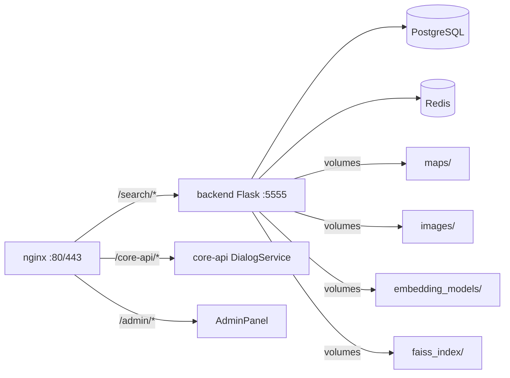
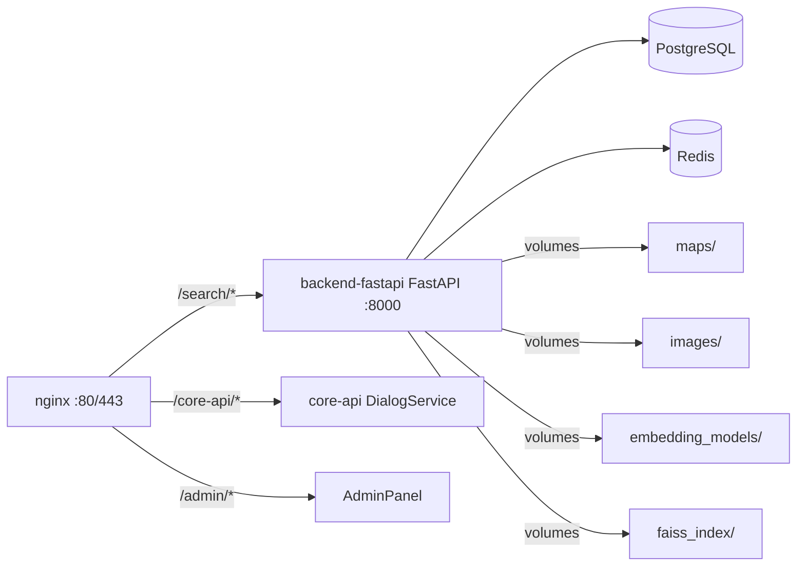

# План миграции: отдельный контейнер backend-fastapi

## Цель
Создать отдельный Docker-контейнер `backend-fastapi` на основе `Eco1-main` (FastAPI), работающий параллельно с текущим Flask-бэкендом (`salut_bot`). После валидации — переключить nginx на FastAPI.

---

## Текущая архитектура



## Целевая архитектура (после миграции)



---

## Пошаговый план

### Шаг 1: Создать папку `backend-fastapi` и скопировать `Eco1-main`

**Действия:**
1. Скопировать `Eco1-main` → `./backend-fastapi/`
2. Удалить мусорные файлы:
   - `flask_response.json`
   - `test_via_nginx.py`
   - `test_working.py`
   - `get_structure.py`
   - `project_structure.txt` (если есть)
3. Создать `.env` на основе `.env.example`

**Проверка:** `ls backend-fastapi/` — видим только нужные файлы

---

### Шаг 2: Адаптировать Dockerfile

**Файл:** `backend-fastapi/Dockerfile`

```dockerfile
FROM python:3.10-slim

WORKDIR /app

# Устанавливаем системные зависимости
RUN apt-get update && apt-get install -y --no-install-recommends \
    gcc \
    && rm -rf /var/lib/apt/lists/*

# Копируем и устанавливаем зависимости
COPY requirements.txt .
RUN pip install --no-cache-dir -r requirements.txt

# Копируем весь код
COPY . .

# Запускаем FastAPI через uvicorn
CMD ["uvicorn", "main_fastapi:app", "--host", "0.0.0.0", "--port", "8000"]
```

**Ключевые отличия от текущего Dockerfile:**
- Базовый образ: `python:3.10-slim` (меньше размер)
- Нет gunicorn (используем uvicorn)
- CMD: `uvicorn main_fastapi:app --host 0.0.0.0 --port 8000`

---

### Шаг 3: Добавить сервис в `docker-compose.yml`

**Добавить в `docker-compose.yml`:**

```yaml
backend-fastapi:
  build: ./backend-fastapi
  restart: always
  depends_on:
    db:
      condition: service_healthy
    redis:
      condition: service_healthy
  env_file:
    - ./backend-fastapi/.env
    - ./shared.env
  volumes:
    - ./maps:/app/maps
    - ./salut_bot/images:/app/images
    - ./salut_bot/embedding_models:/app/embedding_models
    - ./salut_bot/knowledge_base_scripts/Vector/faiss_index:/app/knowledge_base_scripts/Vector/faiss_index:ro
    - ./logs:/app/logs
  environment:
    - PYTHONUNBUFFERED=1
    - DB_HOST=db
    - REDIS_HOST=redis
  extra_hosts:
    - "host.docker.internal:host-gateway"
  networks: [ecobot_net]
```

**Важно:** Используем те же volumes, что и `backend`, чтобы не дублировать данные.

---

### Шаг 4: Настроить nginx

**Добавить location в `nginx/nginx.https.conf`:**

```nginx
# FastAPI backend (новый)
location /fastapi-search/ {
    proxy_pass http://backend-fastapi:8000/;
    proxy_set_header Host $host;
    proxy_set_header X-Real-IP $remote_addr;
    proxy_set_header X-Forwarded-For $proxy_add_x_forwarded_for;
    proxy_set_header X-Forwarded-Proto $scheme;
    proxy_read_timeout 120s;
}
```

**Для переключения** (после валидации) — заменить существующий `/search/` location:

```nginx
# Старый backend (Flask) — закомментировать
# location /search/ {
#     proxy_pass http://backend:5555/;
#     ...
# }

# Новый backend (FastAPI)
location /search/ {
    proxy_pass http://backend-fastapi:8000/;
    ...
}
```

---

### Шаг 5: Собрать и запустить

```bash
# Собрать образ
docker compose build backend-fastapi

# Запустить контейнер
docker compose up -d backend-fastapi

# Проверить логи
docker compose logs -f backend-fastapi
```

---

### Шаг 6: Тестирование

**Тест 1:** Healthcheck
```bash
curl http://localhost:8000/health
# Ожидаемый ответ: {"status": "ok"}
```

**Тест 2:** Поисковый эндпоинт (через nginx)
```bash
curl -X POST http://localhost/fastapi-search/search \
  -H "Content-Type: application/json" \
  -d '{
    "system_parameters": {"user_query": "лиственница", "limit": 5},
    "search_parameters": {
      "modality_type": "Текст",
      "object": {"name_synonyms": {"ru": ["лиственница"]}}
    }
  }'
```

**Тест 3:** Сравнить ответы Flask vs FastAPI
```bash
# Flask
curl -X POST http://localhost/search/search ...

# FastAPI
curl -X POST http://localhost/fastapi-search/search ...
```

**Тест 4:** Запустить тесты из Eco1-main
```bash
docker compose exec backend-fastapi pytest
```

---

### Шаг 7: Переключение (после валидации)

1. Остановить старый `backend`:
   ```bash
   docker compose stop backend
   ```

2. Обновить nginx: заменить `/search/` → `backend-fastapi:8000`

3. Перезагрузить nginx:
   ```bash
   docker compose exec nginx nginx -s reload
   ```

4. Проверить, что всё работает через `/search/`

5. Удалить старый сервис из `docker-compose.yml` (опционально)

---

## Риски и их mitigation

| Риск | Mitigation |
|------|------------|
| FastAPI несовместим с API-контрактом Flask | Сравнить ответы обоих сервисов на одинаковые запросы |
| Асинхронная БД (asyncpg) не работает | Проверить подключение через healthcheck |
| Эмбеддинг-модель не загружается | Проверить volumes и пути в конфиге |
| Redis недоступен | Сервис должен работать и без Redis (fallback) |
| Старые Flask-роуты (app/) не зарегистрированы | В Eco1-main они сохранены, но не используются FastAPI |

---

## Критерии успеха

- [ ] `curl localhost:8000/health` возвращает `{"status": "ok"}`
- [ ] POST `/fastapi-search/search` возвращает те же данные, что и Flask
- [ ] Все тесты из `Eco1-main/tests/` проходят
- [ ] nginx корректно проксирует запросы на FastAPI
- [ ] После переключения — система работает стабильно