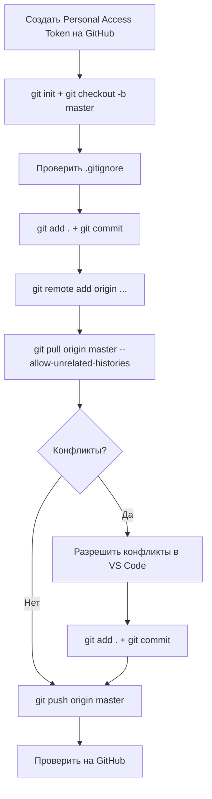

# План: Заливка проекта в репозиторий GitHub

## Исходные данные

- **Локальная папка:** `d:\Praktika2026`
- **Репозиторий:** `https://github.com/Shuon777/DockerEcoBot`
- **Ветка:** `master`
- **Ситуация:** Репозиторий НЕ пустой (там уже есть файлы). Локально Git НЕ инициализирован.
- **Протокол:** HTTPS (через Personal Access Token)

---

## Пошаговый план

### Шаг 0: Остановить запущенные процессы (опционально)

В терминалах сейчас крутятся Python-процессы (`api.py`). Они не помешают Git, но если будут проблемы с доступом к файлам, можно их остановить через `Ctrl+C` в соответствующих терминалах VS Code.

---

### Шаг 1: Создать Personal Access Token на GitHub

Токен нужен, чтобы Git мог авторизоваться на GitHub через HTTPS.

**Инструкция:**
1. Зайти на GitHub → Settings → Developer settings → Personal access tokens → Tokens (classic)
2. Нажать **"Generate new token (classic)"**
3. Задать имя (например, `DockerEcoBot-push`)
4. Срок действия: выбрать (например, 90 дней или No expiration)
5. Выбрать права (scopes): поставить галочку **`repo`** (полный доступ к репозиториям)
6. Нажать **"Generate token"**
7. **Скопировать токен сразу** — он покажется только один раз!

**Прямая ссылка:** https://github.com/settings/tokens

---

### Шаг 2: Инициализировать Git-репозиторий локально

Открыть терминал в VS Code (`Ctrl+``) и выполнить:

```bash
cd d:\Praktika2026
git init
git checkout -b master
```

- `git init` — создаёт пустой Git-репозиторий в папке
- `git checkout -b master` — создаёт и переключается на ветку `master`

---

### Шаг 3: Настроить .gitignore

В корне проекта уже есть файл `.gitignore`. Нужно убедиться, что он исключает:

- `__pycache__/`, `*.pyc` — кэш Python
- `.env`, `.env.*` — секреты (кроме `.env.example`)
- `node_modules/` — если есть
- `venv/`, `.venv/` — виртуальное окружение
- `*.db`, `*.sqlite`, `*.sqlite3` — базы данных
- `*.log`, `logs/` — логи
- `data/`, `storage/`, `volumes/` — данные
- `images/` — большие изображения
- `embedding_models/` — ML-модели
- `certbot/conf/*`, `certbot/www/*` — SSL-сертификаты
- `dist/`, `build/`, `.next/` — сборки
- `.DS_Store`, `Thumbs.db` — системные файлы
- `salut_bot/embedding_models/` — локальные модели
- `dsapi/local_models/` — локальные ML-модели
- `*.pem`, `*.key`, `*.crt`, `*.csr` — сертификаты
- `*.tar.gz`, `*.tar`, `*.zip` — архивы
- `*.bin`, `*.gguf`, `*.pt`, `*.pth`, `*.onnx`, `*.safetensors` — ML-модели

**Важно:** `.gitignore` уже должен быть в репозитории на GitHub (если проект оттуда скачан). Если его нет — нужно создать.

---

### Шаг 4: Сделать первый коммит локально

```bash
git add .
git status   # проверить, какие файлы попадут в коммит
```

Проверить, что не добавляются лишние файлы (базы данных, кэш, большие модели, фото).

Если всё ок — сделать коммит:

```bash
git commit -m "Initial commit: full project with all services"
```

Если нужно что-то исключить — добавить в `.gitignore` и повторить `git add .`

---

### Шаг 5: Связать локальный репозиторий с удалённым

```bash
git remote add origin https://github.com/Shuon777/DockerEcoBot.git
```

Проверить:

```bash
git remote -v
```

Должно показать:
```
origin  https://github.com/Shuon777/DockerEcoBot.git (fetch)
origin  https://github.com/Shuon777/DockerEcoBot.git (push)
```

---

### Шаг 6: Скачать изменения из репозитория (git pull)

Это **самый ответственный шаг**. Нужно смержить то, что уже есть в репозитории, с локальными изменениями.

```bash
git pull origin master --allow-unrelated-histories
```

Флаг `--allow-unrelated-histories` обязателен, потому что локальный и удалённый репозитории не имеют общей истории (ты скачал архив, а не клонировал репозиторий).

**Что произойдёт:**
- Git скачает файлы из репозитория
- Попытается автоматически смержить их с локальными
- Если в одних и тех же файлах есть различия — возникнут **конфликты**

---

### Шаг 6.1: Разрешить конфликты (если будут)

Если `git pull` выдаст сообщение о конфликтах (`CONFLICT`), нужно:

1. Открыть конфликтующие файлы в VS Code
2. VS Code подсветит конфликтные участки:
   ```
   <<<<<<< HEAD
   твои изменения
   =======
   изменения из репозитория
   >>>>>>> master
   ```
3. Вручную выбрать, что оставить (или объединить оба варианта)
4. Удалить маркеры `<<<<<<<`, `=======`, `>>>>>>>`
5. Сохранить файл

После разрешения всех конфликтов:

```bash
git add .
git commit -m "Merge: resolve conflicts between local and remote"
```

---

### Шаг 7: Запушить изменения в master

```bash
git push origin master
```

**Git запросит логин и пароль:**
- **Username:** твой GitHub username (например, `Shuon777`)
- **Password:** вставить **Personal Access Token** (не обычный пароль!)

Если не хочешь вводить каждый раз, можно сохранить токен:

```bash
git config --global credential.helper store
```

После этого токен спросят только один раз.

---

### Шаг 8: Проверить результат

1. Открыть в браузере: https://github.com/Shuon777/DockerEcoBot
2. Убедиться, что все файлы отображаются
3. Проверить, что нет лишних файлов (базы данных, кэш, .env с секретами)

---

## Важные предостережения

| Что может пойти не так | Как избежать |
|------------------------|-------------|
| **Случайно закоммитятся секреты** (.env, пароли, токены) | Проверить `.gitignore`, выполнить `git status` перед коммитом |
| **Большие файлы** (фото, ML-модели) попадут в репозиторий | GitHub не принимает файлы >100MB. Убедись, что `images/`, `*.bin`, `*.pt` и т.д. в `.gitignore` |
| **Конфликты при pull** | Разрешать вручную через VS Code |
| **Отсутствие --allow-unrelated-histories** | Pull упадёт с ошибкой — просто добавить флаг |
| **Токен не сохранился** | Использовать `git config --global credential.helper store` |

---

## Схема процесса



---

## Команды одной строкой (если без конфликтов)

```bash
cd d:\Praktika2026
git init
git checkout -b master
git add .
git commit -m "Initial commit: full project with all services"
git remote add origin https://github.com/Shuon777/DockerEcoBot.git
git pull origin master --allow-unrelated-histories
git push origin master