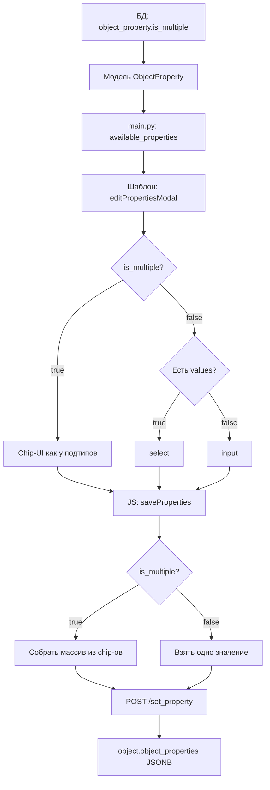

# План: Поддержка множественного выбора для свойств объекта (is_multiple)

## Контекст

В таблицу `eco_assistant.object_property` добавлена колонка `is_multiple bool`.
Если флаг `true` — в модалке редактирования свойств объекта можно выбрать несколько значений
(аналогично тому, как сейчас реализован выбор подтипов через chip-UI).

## Текущая архитектура

### Модель (`AdminPanel/models/eco_assistant_models.py`)
- `ObjectProperty` — таблица `eco_assistant.object_property`
- Поля: `id`, `object_type_id`, `property_name`, `property_values` (ARRAY(Text)), `created_at`, `updated_at`
- Поле `is_multiple` в модели **отсутствует** (в БД уже добавлено)

### Бэкенд (`AdminPanel/main.py`)
- Три роута формируют `available_properties` для шаблонов:
  - `biological_edit` (строка ~883)
  - `geographical_edit` (строка ~1973)
  - `service_edit` (строка ~2734)
- Каждый элемент словаря: `{ "id", "name", "values", "json_key" }`
- Три эндпоинта `set_property`:
  - `POST /biological/{id}/set_property`
  - `POST /geographical/{id}/set_property`
  - `POST /service/{id}/set_property`
- Все три идентичны: берут `{ properties: {...} }`, мержат в `object.object_properties`

### Шаблоны (`AdminPanel/templates/*_edit.html`)
- Модалка `editPropertiesModal` рендерит поля для каждого свойства:
  - Если `prop.name == 'подтип объекта'` — chip-UI (мультивыбор)
  - Если `prop.values|length > 0` — `<select>` (один выбор)
  - Иначе — `<input>` (свободный ввод)
- JS `saveProperties()`:
  - Для подтипов: собирает массив из chip-ов → `props['Подтип объекта'] = [массив]`
  - Для остальных: `props[json_key] = el.value` (одно значение)

## План изменений

### Шаг 1: Модель — добавить поле is_multiple

**Файл:** `AdminPanel/models/eco_assistant_models.py` (строка ~487)

Добавить после `updated_at`:
```python
is_multiple = Column(Boolean, default=False, server_default='false', nullable=False,
                     doc='Флаг: можно ли выбрать несколько значений для этого свойства')
```

### Шаг 2: Бэкенд — добавить is_multiple в available_properties

**Файл:** `AdminPanel/main.py`

В трёх местах (строки ~883, ~1973, ~2734) добавить в словарь:
```python
"is_multiple": p.is_multiple,
```

### Шаг 3: Шаблоны — модалка editPropertiesModal

**Файлы:** 
- `AdminPanel/templates/biological_edit.html` (строка ~923)
- `AdminPanel/templates/geographical_edit.html` (строка ~888)
- `AdminPanel/templates/service_edit.html` (строка ~876)

Логика рендеринга поля свойства:

```
если prop.name == 'подтип объекта':
    [оставить как есть — chip-UI]
иначе если prop['values']|length > 0 И prop['is_multiple']:
    [НОВОЕ: chip-UI как у подтипов, но с id="prop_{prop.name}-chips"]
    [добавить datalist с допустимыми значениями]
    [input + кнопка "Добавить"]
иначе если prop['values']|length > 0:
    [оставить как есть — <select>]
иначе:
    [оставить как есть — <input>]
```

**Важно:** Для chip-UI нужно использовать уникальные id, чтобы не было конфликта с подтипами:
- `prop_{{ prop.name }}_chips` — контейнер chip-ов
- `prop_{{ prop.name }}_datalist` — datalist
- `prop_{{ prop.name }}_input` — input для ввода

### Шаг 4: Шаблоны — JS saveProperties

**Файлы:** 
- `AdminPanel/templates/biological_edit.html` (строка ~1565)
- `AdminPanel/templates/geographical_edit.html` (строка ~1619)
- `AdminPanel/templates/service_edit.html` (строка ~1388)

Логика сбора данных:

```
если prop.name == 'подтип объекта':
    [оставить как есть — сбор chip-ов]
иначе если prop['is_multiple']:
    [собрать chip-ы из prop_{{ prop.name }}_chips]
    [сохранить как массив: props[json_key] = [массив]]
иначе:
    [оставить как есть — el.value]
```

### Шаг 5: Отображение на карточке объекта

**Файлы:** 
- `AdminPanel/templates/biological_edit.html` (строка ~116)
- `AdminPanel/templates/geographical_edit.html` (строка ~101)
- `AdminPanel/templates/service_edit.html` (строка ~99)

Сейчас для «Географической зоны» показывается одно значение:
```jinja

<p class="mb-0">{{ props.get('Географическая зона') }}</p>

```

Нужно учитывать, что значение может быть как строкой (для обратной совместимости), так и массивом:
```jinja


<p class="mb-0">
  
    {{ geo_zone }}
  
    
    <span class="badge bg-light text-dark border me-1">{{ z }}</span>
    
  
</p>

```

## Детальная схема изменений



## Проверка

После реализации убедиться:
1. Для свойства «Географическая зона» в БД стоит `is_multiple = true`
2. В модалке для «Географическая зона» отображается chip-UI
3. Можно добавить несколько географических зон
4. При сохранении в JSONB сохраняется массив
5. На карточке объекта отображаются все выбранные зоны
6. Для свойств с `is_multiple = false` поведение не изменилось