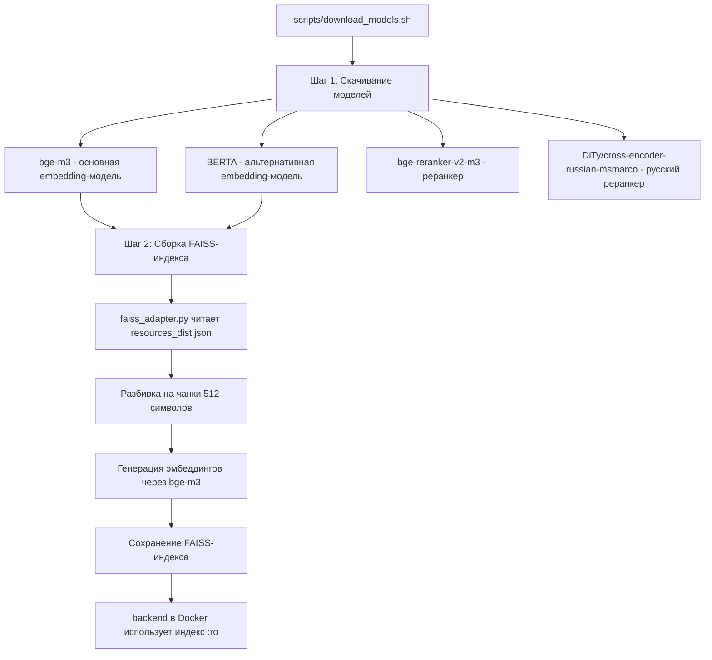

# План развёртывания RAG-системы

## Текущий статус

| Компонент | Статус |
|---|---|
| Код RAG-системы (FAISS + SearchService) | ✅ Установлен |
| Embedding-модели на диске | ❌ Отсутствуют |
| FAISS-индекс | ❌ Не собран |
| Скрипты установки | ✅ Готовы |

## Архитектура RAG



## Пошаговый план

### Шаг 1: Скачивание embedding-моделей

**Способ A (рекомендуемый) — через Docker:**
```bash
# Из корня проекта d:/Praktika2026
docker compose run --rm --no-deps backend python scripts/download_embedding_model_from_HF.py "BAAI/bge-m3"
```

**Способ B — через bash-скрипт (скачивает всё сразу):**
```bash
# Из корня проекта
bash scripts/download_models.sh
```

**Способ C — напрямую Python (если есть локальное окружение):**
```bash
cd salut_bot
pip install -r requirements.txt
python scripts/download_embedding_model_from_HF.py "BAAI/bge-m3"
```

**Что будет скачано:**
- `salut_bot/embedding_models/bge-m3/` — ~2.2 GB (основная модель)
- `salut_bot/embedding_models/BERTA/` — ~1.5 GB (альтернатива)
- `salut_bot/embedding_models/rerankers/DiTy_cross-encoder-russian-msmarco/` — ~1 GB (реранкер)

### Шаг 2: Сборка FAISS-индекса

**Запуск через Docker:**
```bash
docker compose run --rm backend python -m knowledge_base_scripts.Vector.faiss_adapter
```

**Или напрямую:**
```bash
cd salut_bot
python -m knowledge_base_scripts.Vector.faiss_adapter
```

**Что произойдёт:**
1. Скрипт прочитает `salut_bot/json_files/resources_dist.json`
2. Разобьёт тексты на чанки по 512 символов
3. Сгенерирует эмбеддинги через загруженную модель `bge-m3`
4. Сохранит FAISS-индекс в `salut_bot/knowledge_base_scripts/Vector/faiss_index/`
5. Выполнит тестовый поиск по 5 запросам

**Ожидаемый результат:**
```
📁 Индекс сохранен в: .../knowledge_base_scripts/Vector/faiss_index
Созданные файлы индекса:
  index.faiss (X KB)
  index.pkl (X KB)
```

### Шаг 3: Проверка работоспособности

**Через тестовый эндпоинт (после запуска backend):**
```
GET /test_faiss_search?query=байкальская+нерпа&k=5&similarity_threshold=0.5
```

**Через статус-эндпоинт:**
```
GET /faiss_status
```

Ожидаемый ответ:
```json
{
  "faiss_index_path": "...",
  "faiss_vectorstore_loaded": true,
  "index_size": 1234,
  "resources_count": 500
}
```

## Важные замечания

1. **Размер моделей:** ~4-5 GB суммарно, потребуется стабильный интернет
2. **HF_TOKEN:** Рекомендуется задать переменную `HF_TOKEN=hf_...` для ускорения скачивания с HuggingFace
3. **Реранкер** (`DiTy/cross-encoder-russian-msmarco`) работает только при наличии GPU (CUDA)
4. **Docker-монтирование:** Индекс монтируется в режиме `:ro` (read-only) — см. `docker-compose.yml:46`
5. **Пересборка индекса:** Нужна при любом изменении `resources_dist.json`