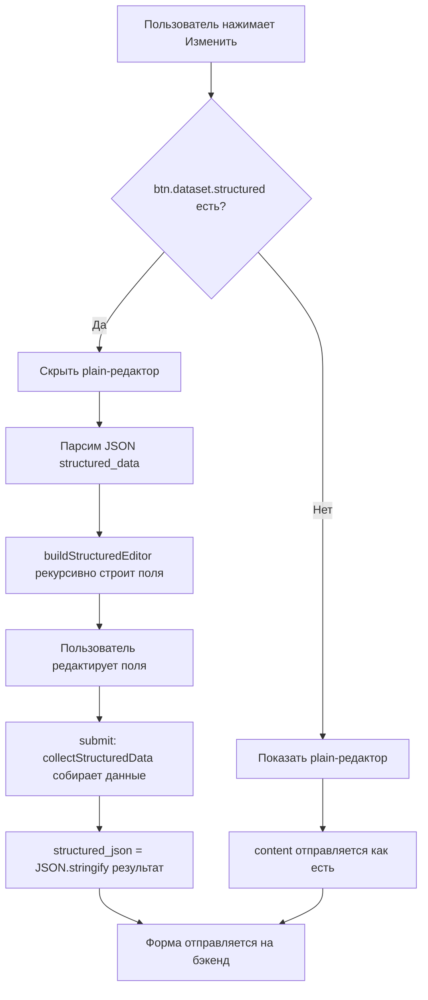

# План: Добавление редактирования structured_data в админ-панель

## Проблема
В рабочей папке `AdminPanel/templates/` при редактировании текстовых ресурсов (кнопка "Изменить") модальное окно не показывает поля структурированных данных (structured_data), хотя при просмотре (view) данные отображаются корректно.

## Причина
В шаблонах отсутствует фронтенд-функционал для работы со structured_data:
- Кнопка редактирования не передаёт `data-content-key` и `data-structured`
- Модалка `editTextModal` не содержит скрытых полей и блока structured-редактора
- JS-функция `openEditText` не обрабатывает structured_data
- Отсутствуют функции `humanizeFieldKey`, `buildStructuredEditor`, `collectStructuredData`
- Отсутствует обработчик `submit` для сериализации structured_json

## Решение
Перенести функционал из `AdminPaneledited/` в `AdminPanel/` для трёх файлов.

---

## Файл 1: `AdminPanel/templates/biological_edit.html`

### Изменение A — Кнопка редактирования текста (строка ~222)
**Было:**
```html
<button class="btn btn-sm btn-outline-warning border-0" title="Редактировать"
        data-resource-id="{{ t.id }}"
        data-title="{{ t.title | default('', true) | replace('"', '"') }}"
        data-content="{{ t.content | default('', true) | replace('"', '"') }}"
        onclick="openEditText(this)">
    <i class="bi bi-pencil"></i>
</button>
```

**Стало:**
```html
<button class="btn btn-sm btn-outline-warning border-0" title="Редактировать"
        data-resource-id="{{ t.id }}"
        data-title="{{ t.title | default('', true) | replace('"', '"') }}"
        data-content="{{ t.content | default('', true) | replace('"', '"') }}"
        data-content-key="{{ t.content_key or 'description' }}"
        data-structured='{{ (t.structured_data | tojson | safe) if t.structured_data else "" }}'
        onclick="openEditText(this)">
    <i class="bi bi-pencil"></i>
</button>
```

### Изменение B — Модалка editTextModal (строки ~795-822)
**Было:** простая форма с title + content
**Стало:** форма с дополнительными скрытыми полями и structured-редактором

Добавить после `<input type="hidden" name="entity_id" value="{{ entity.id }}">`:
```html
<input type="hidden" name="content_key" id="editTextContentKey" value="">
<input type="hidden" name="structured_json" id="editTextStructuredJson" value="">
```

Заменить блок textarea на:
```html
<div id="editTextPlainWrap" class="mb-3">
    <label class="form-label fw-bold small text-secondary">СОДЕРЖАНИЕ *</label>
    <textarea class="form-control" name="content" id="editTextContent" rows="8"></textarea>
</div>
<div id="editTextStructuredWrap" class="d-none">
    <div class="alert alert-light border small text-secondary mb-3">
        <i class="bi bi-info-circle"></i> Это структурированный ресурс — отредактируйте отдельные поля ниже, структура сохранится.
    </div>
    <div id="editTextStructuredFields"></div>
</div>
```

### Изменение C — JS-функции (после строки ~1113)
**Заменить** функцию `openEditText` на новую версию и **добавить** после неё:
- `humanizeFieldKey(key)` — словарь меток
- `buildStructuredEditor(container, data, pathPrefix)` — рекурсивный редактор
- `collectStructuredData(container)` — сбор данных из редактора
- Обработчик `submit` на `editTextForm`

---

## Файл 2: `AdminPanel/templates/geographical_edit.html`

Те же изменения, что и для biological_edit.html, но с учётом:
- Путь action: `/admin/geographical/resource/edit/text/`
- Кнопка редактирования находится на строке ~211

---

## Файл 3: `AdminPanel/templates/service_edit.html`

Те же изменения, что и для biological_edit.html, но с учётом:
- Путь action: `/admin/service/resource/edit/text/`
- Кнопка редактирования находится на строке ~210

---

## Проверка бэкенда

Необходимо убедиться, что бэкенд-маршруты (`/admin/{section}/resource/edit/text/{id}`) принимают и обрабатывают поле `structured_json`. Судя по резюме разговора, бэкенд поддерживает сохранение structured_data, но требуется верификация.

---

## Диаграмма потока данных



## Порядок выполнения для каждого файла

1. **Кнопка**: добавить `data-content-key` и `data-structured`
2. **Модалка**: добавить `content_key`, `structured_json` hidden + `editTextStructuredWrap` блок
3. **JS**: заменить `openEditText`, добавить `humanizeFieldKey`, `buildStructuredEditor`, `collectStructuredData`, обработчик `submit`